# ⚡ GitHub Profile Telemetry & Dithered Banner Generator
> ابزار اختصاصی و خودکار تولید بنر متحرک زنده با شبیه‌ساز ترمینال، پرتره دایتر تک‌بیتی Floyd-Steinberg و استایل تلمتری برای پروفایل گیت‌هاب.  
> **طراحی و توسعه‌یافته توسط [HELBOY CODER](https://github.com/HELBOYCODER)**

<div align="center">
  <picture>
    <source media="(prefers-color-scheme: dark)" srcset="demo/banner-dark.svg">
    <source media="(prefers-color-scheme: light)" srcset="demo/banner-light.svg">
    
  </picture>
</div>

<br>

<p align="center">
  <a href="https://github.com/HELBOYCODER/profile-telemetry-banner/blob/main/LICENSE">
    
  </a>
  &nbsp;
  <a href="https://x.com/hellboy_code">
    
  </a>
  &nbsp;
  <a href="https://github.com/HELBOYCODER">
    
  </a>
</p>

---

## 🎯 ایده و معماری پروژه

بسیاری از ابزارهای بنر ساز گیت‌هاب به گیف‌های سنگین یا تصاویر ایستا متکی هستند که در تم‌های تیره و روشن کیفیت خود را از دست می‌دهند. این پروژه با استفاده از یک خط پردازش پایتون (PIL و NumPy) تصویر آواتار شما را به یک ساختار برداری SVG سبک، شارپ و متحرک تبدیل می‌کند:

1. **دایترینگ مارپیچی (Serpentine Floyd-Steinberg Dithering):**
   - تبدیل تصویر به یک گرید ۳۰۰×۳۴۰ با کنتراست تقویت‌شده و فیلتر UnsharpMask.
   - پخش خطای متناوب از راست به چپ و چپ به راست که مانع ایجاد خطوط پترنی موازی می‌شود.
2. **فشرده‌سازی مسیرها (Run-Length Path Compression):**
   - به جای رندر کردن هزاران تگ مجزای دایره، نقاط هم‌جوار افقی به یک بردار متوالی ادغام می‌شوند (حجم زیر ۳۵۰ کیلوبایت).
3. **انیمیشن درخشش ارگانیک (CSS Shimmer Effect):**
   - نقاط بردار به ۴۵ گروه تصادفی نامنظم تقسیم شده و با تاخیرهای متغیر در زمان لود صفحه به صورت یک موج درخشان پدیدار می‌شوند.
4. **تلمتری زنده و بج ضربان‌دار:**
   - نمایش مشخصات فنی، زبان‌ها، متدولوژی و اطلاعات هویتی با تراز اتوماتیک و خطوط نقطه‌چین راهنما.
   - بج لایو با انیمیشن پالس قلب و فیلتر Gaussian Glow.
5. **سازگاری با پروکسی Camo و کش CDN گیت‌هاب:**
   - اسکیپ کامل تمام کاراکترهای رزرو شده XML (به‌ویژه `&amp;`) تا از خطای متداول `not well-formed` در مرورگرها جلوگیری شود.

---

## 🚀 نصب و اجرای سریع (CLI Mode)

### پیش‌نیازها
تنها به پایتون ۳ و کتابخانه‌های پایه پردازش تصویر نیاز دارید:
```bash
pip install pillow numpy
```
*(در Alpine Linux یا محیط‌های ترمینال سبک: `apk add py3-pillow py3-numpy`)*

### اجرای اسکریپت
تصویر پرتره خود را آماده کنید (پیشنهاد: پس‌زمینه ساده، نور یکنواخت) و دستور زیر را اجرا کنید:

```bash
python3 generator.py \
  --image my-photo.png \
  --username YOUR_GITHUB_USERNAME \
  --name "نام شما" \
  --role "Full-Stack Developer" \
  --origin "Tehran, Iran" \
  --langs "Python · TypeScript · Go" \
  --outdir ./output
```

خروجی این دستور دو فایل زیر در پوشه مقصد خواهد بود:
- `banner-dark.svg`: بهینه‌شده برای تم دارک (پالت `#0A101F` / `#22D3EE` / `#A78BFA`)
- `banner-light.svg`: بهینه‌شده برای تم لایت (پالت `#F8FAFC` / `#0891B2` / `#7C3AED`)

---

## 🤖 نحوه استفاده در تمام ایجنت‌های هوش مصنوعی (AI Agents)

این پلتفرم به صورت ماژولار طراحی شده تا بتوانید بدون نیاز به تغییر دستی کد، به هر ایجنت هوش مصنوعی (Claude Code، Cursor، Windsurf، Copilot CLI یا Minis) پرامپت دهید:

### پرامپت آماده برای ایجنت:
```text
مخزن https://github.com/HELBOYCODER/profile-telemetry-banner را بررسی کن.
اسکریپت generator.py را با عکس آواتار من در مسیر [PATH_TO_IMAGE] اجرا کن.
مشخصات زیر را برای تلمتری تنظیم کن:
- نام: [نام شما]
- یوزرنیم گیت‌هاب: [یوزرنیم]
- تخصص: [تخصص شما]
- زبان‌ها: [زبان‌های مورد نظر]
دو فایل banner-dark.svg و banner-light.svg تولید شده را به مخزن پروفایل من (username/username) منتقل کرده، ورک‌فلو مار (snake.yml) را تنظیم کن و با کامیت به برنچ main پوش کن. در پایان سلامت ساختاری XML را با پایتون تست کن.
```

---

## 🧩 فازهای راه‌اندازی پروفایل کامل

پروفایل گیت‌هاب شامل ۴ جزء کلیدی است:

### فاز ۱: بنر اصلی
فایل‌های `banner-dark.svg` و `banner-light.svg` را داخل ریشه مخزن پروفایل خود (`username/username`) قرار دهید.

### فاز ۲: ادغام در README
محتوای فایل آماده [profile-template.md](profile-template.md) را کپی کرده و در `README.md` مخزن پروفایل قرار دهید. (تنها کافیست یوزرنیم خود را جایگزین کنید).

### فاز ۳: مار سهم‌گیری (Contribution Snake)
ورک‌فلو آماده [.github/workflows/snake.yml](.github/workflows/snake.yml) را داخل مخزن پروفایل کپی کنید.  
در بخش **Settings > Actions > General > Workflow permissions** مخزن، گزینه **Read and write permissions** را فعال کنید. با هر پوش یا هر ۱۲ ساعت یکبار، مار متحرک فعالیت‌های گیت‌هاب شما را ثبت می‌کند.

### فاز ۴: بج‌های شبکه‌های اجتماعی
بج‌های اختصاصی شیلدز با پالت رنگی ترمینال در انتهای فایل تمپلیت قرار دارند و لینک‌های شما را سازمان‌دهی می‌کنند.

---

## ⚠️ نکات کلیدی و عیب‌یابی (Troubleshooting)

1. **خطای نمایش متن به جای تصویر (`profile.sh --live`):**  
   اگر به جای بنر متن آلترناتیو نمایان شد، فایل SVG خطای XML دارد. اسکریپت ما این موضوع را با `html.escape` و اعتبارسنجی خودکار `xml.etree.ElementTree` به طور کامل برطرف کرده است.
2. **عدم نمایش تغییرات (Fastly CDN Cache):**  
   گیت‌هاب فایل‌های تصویری را تا ۳۰۰ ثانیه کش می‌کند. برای مشاهده تغییرات آنی در README، می‌توانید انتهای آدرس هش کامیت مستقیم بگذارید یا پارامتر `?v=1` اضافه کنید.
3. **تصویر پس‌زمینه پرتره:**  
   برای تم دارک، تصاویری که پس‌زمینه تیره یا یکدست دارند بالاترین تفکیک‌پذیری را با فیلتر دایتر ایجاد می‌کنند.

---

## 📄 لایسنس
این پروژه تحت لایسنس **MIT** منتشر شده است. استفاده، ویرایش و توسعه آزاد است.

**ساخته‌شده با تمرکز بر کیفیت، سرعت و مینیمالیسم توسط [HELBOY CODER](https://github.com/HELBOYCODER)**
